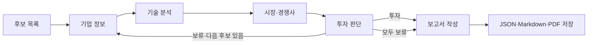

# Physical AI 스타트업 투자 분석

## Overview

Physical AI 기업을 조사하고 투자 판단 보고서를 만드는 5인 팀 프로젝트입니다.
분야와 개인별 담당 역할은 정했으며 실제 분석 기업은 아직 정하지 않았습니다.
지금은 **가상 기업으로 연결을 확인하는 실행 틀**입니다. 실제 LLM·RAG는 각 담당자가 구현해야 합니다.
API 키나 모델 다운로드 없이 예제를 실행할 수 있습니다.

## Features

| 지금 가능한 일 | 앞으로 구현할 일 |
| --- | --- |
| 5개 역할을 LangGraph로 연결 | 실제 기업 자료 수집·검색·분석 |
| 한 역할만 따로 실행 | LLM과 오픈소스 임베딩을 이용한 Agentic RAG |
| 보류하면 다음 후보로 이동, 모두 보류하면 종료 | 근거가 있는 투자 기준·평가 |
| 상태 JSON·보고서 Markdown·PDF 저장 | 실제 출처가 있는 최종 보고서 |

교수님 [과제 안내](https://actually-war-1ea.notion.site/AI-1cf7f4c86693800e9e11fa490ed1a2ff)에 맞춰 완성할 조건입니다.

- LangGraph 멀티에이전트·Agentic RAG 사용, 탐색·기술·시장 중 최소 한 역할에 RAG 적용.
- 분석 대상은 Physical AI 분야의 비상장 Seed~Series C 기업이며, Exit를 완료하지 않은 기업.
- 검색에 사용하는 문서는 개수와 관계없이 **전체 200쪽 이하**. 오픈소스 임베딩 사용 및 선택 이유 설명.
- 투자 보류 시 다음 후보 분석, 모든 후보 보류 시에도 이유를 담은 보고서로 종료.
- 최종 PDF **5쪽 이하**, Summary 반 쪽 이하, Reference에 실제 사용한 출처 기재.
- README를 바탕으로 10분 발표. 시장과 경쟁사 분석을 합쳐 교수님 예시의 6역할을 5역할로 운영합니다.

## Tech Stack

| 항목 | 사용 |
| --- | --- |
| Python / LangGraph | 수업 기준 Python 3.11 / LangGraph 1.0.9 |
| 환경 설정 | python-dotenv (`main.py`가 프로젝트의 `.env`를 읽음) |
| PDF 저장·검사 | reportlab / pypdf |
| LLM·임베딩·검색 저장소 | 팀에서 선택 후 담당자가 추가 |
| 검색 평가 | Hit Rate@K / MRR: **미측정**. 실제 RAG 구현 후 측정값 기록 |

## Agents

| 역할 | 담당자 | 수정할 파일 | 반환할 키 |
| --- | --- | --- | --- |
| A. 기업 탐색·정보 | 박종찬 | `agents/company.py` | `company_info` |
| B. 기술 분석 | 김민정 | `agents/technology.py` | `technology` |
| C. 시장·경쟁사 분석 | 김희윤 | `agents/market_competition.py` | `market_competition` |
| D. 투자 판단 | 이현우 | `agents/investment.py` | `investment` |
| E. 보고서 본문 전체 작성 | 박진원 | `agents/report.py` | `report` |

각 파일의 `run(state)`를 구현하면 됩니다. 입력·출력 약속은 `shared.py`에 있습니다.
다른 4개 역할은 예제로 둔 채 내 역할부터 시험할 수 있습니다. [담당자 안내](docs/agent-guide.md)를 먼저 읽어주세요.
내 역할 하나의 완성은 개별 개발 단계입니다. 앞 단계에 예제가 남아 있으면 전체 결과도 연습용으로 표시됩니다.

## Architecture



후보는 사람이 `data/companies.json`에 정해도 됩니다. 자동 후보 탐색은 선택 사항입니다.
분석 기록은 `history`에 모으며, 보고서 담당자는 본문을 만들고 공통 저장 코드가 PDF를 만듭니다.

## Directory Structure

| 경로 | 용도 |
| --- | --- |
| `main.py` / `shared.py` | 실행·연결 / 공통 입력·출력 형식 |
| `agents/` | 팀원별 함수 5개 |
| `data/` | 후보 목록·단독 시험용 입력 ([설명](data/README.md)) |
| `export_outputs.py` | 결과 파일·PDF 저장 |
| `tests/` | 연결과 입력·출력 약속 검사 |
| `docs/agent-guide.md` / `start.ipynb` | 담당자 안내 / 실행 노트북 |
| `outputs/` | 실행 결과, Git에 올리지 않음 |

## Usage

저장소를 내려받은 후 그 폴더에서 실행합니다. 기존 수업 환경 대신 **프로젝트 전용 `.venv`**를 권장합니다.

```bash
git clone https://github.com/nowjinpark/ai-startup-investment-agent.git
cd ai-startup-investment-agent
python3.11 -m venv .venv
source .venv/bin/activate
python -m pip install -r requirements.txt
python main.py
```

Windows에서는 환경 생성에 `py -3.11 -m venv .venv`, 활성화에 PowerShell 기준 `.venv\Scripts\Activate.ps1`을 사용합니다.
전체 실행 결과는 `outputs/state.json`, `outputs/report.md`, `outputs/report.pdf`에 저장됩니다.
PDF는 Mac의 AppleGothic, Windows의 맑은 고딕, Linux의 NanumGothic을 자동으로 찾습니다. 없으면 `.env`의 `REPORT_FONT_PATH`에 한글 TTF 파일 위치를 넣고 PDF 화면도 확인하세요.
지금은 가상 기업 둘 다 보류하는 예제입니다. 실행 성공이 실제 AI 분석의 완성을 뜻하지는 않습니다.

```bash
python main.py --agent technology
python main.py --agent technology --state data/test_state.json --output outputs/technology
python main.py --companies data/companies.json --output outputs/full
```

`--agent`에는 위 표의 파일명에서 `.py`를 뺀 이름을 넣습니다. 기본 입력은 `data/test_state.json`입니다.
`--state`는 단독 실행의 입력, `--companies`는 전체 실행의 후보 목록, `--output`은 결과 폴더를 바꿉니다.
단독 결과는 `outputs/역할명.json`에 저장됩니다. `report` 단독 실행은 Markdown·PDF도 만듭니다.
노트북 사용자는 `start.ipynb`에서 `.venv`의 Python을 커널로 선택하고 위에서부터 실행하세요.
노트북을 사용할 때만 필요하면 활성화한 `.venv`에 `python -m pip install ipykernel`을 실행합니다.
실제 API 연동 때만 `.env.example`을 참고해 프로젝트 루트에 `.env`를 만드세요. 키와 `.env`는 Git에 올리지 않습니다.

작업은 **개인 브랜치 → 내 역할 단독 실행 → 전체 실행 → PR → 조원 검토 후 병합** 순서입니다.
각자 자기 역할 파일과 필요한 프롬프트·출처 자료를 수정하고, `shared.py`·`main.py` 변경은 먼저 팀과 협의합니다.
CI는 5개 함수를 예제로 바꿔 연결·반환 형식을 검사하며 유료 API를 호출하지 않습니다. 실제 AI 품질은 각자 수동으로 확인해야 합니다.

## Contributors

| 이름 | 담당 | GitHub |
| --- | --- | --- |
| 김민정 | B. 기술 분석 | — |
| 김희윤 | C. 시장·경쟁사 분석 | — |
| 박종찬 | A. 기업 탐색·정보 | — |
| 박진원 | E. 보고서 본문 전체 작성 | [nowjinpark](https://github.com/nowjinpark) |
| 이현우 | D. 투자 판단 | — |
