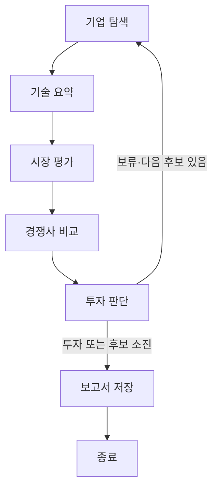

# AI Startup Investment Evaluation Agent

**기업 자료를 읽고, 투자할 만한지 근거와 함께 평가하는 AI를 만드는 과제입니다.**

[교수님 과제 안내](https://actually-war-1ea.notion.site/AI-1cf7f4c86693800e9e11fa490ed1a2ff)를 기준으로 진행합니다.
대상 회사는 아직 미정입니다. 회사가 바뀌어도 같은 틀을 사용합니다.

> 지금 코드는 **가상기업으로 실행 순서와 파일 저장을 연습하는 시작 코드**입니다.
> 실제 자료 검색·AI 분석은 앞으로 만들 부분입니다. 예제 보고서는 제출용이 아닙니다.

## Overview · 무엇을 만드나요?

자료를 모으고 → 기술·시장·경쟁사를 분석하고 → 투자 또는 보류를 판단하고 → 보고서를 저장합니다.
찾은 자료를 답변의 근거로 사용하는 것이 **RAG**이고, 작업 순서와 갈림길을 연결하는 도구가 **LangGraph**입니다.

## Features · 지금 되는 일과 남은 일

| 지금 되는 일 | 앞으로 만들 일 |
|---|---|
| 6단계 작업 연결 | 실제 기업 자료 읽기·검색 |
| 보류하면 다음 후보로 이동 | 오픈소스 임베딩 비교·선정 |
| 후보를 다 보면 종료 | 근거를 바탕으로 AI가 분석·판단 |
| 예제 결과를 PDF로 저장 | 검색 필요성 판단·도구 호출·관련성 확인 |
| 기본 동작 자동 확인 | 실제 결과 평가·최종 보고서 작성 |

**자료가 부족하면 재검색하거나 보류하는 동작까지 완성해야 합니다.** 단순히 함수를 순서대로 실행하는 것만으로 Agentic RAG가 완성되지는 않습니다.

## Usage · 처음 시작하는 순서

1. 아래 명령으로 저장소를 받습니다.
2. 수업에서 사용한 **Python 3.11 / LangGraph 환경**을 선택합니다. VS Code 노트북도 같은 커널을 선택합니다.
3. 필요한 패키지를 설치하고 `start.ipynb`를 위에서부터 실행합니다. 터미널에서는 `python app.py`로 같은 예제를 실행할 수 있습니다.

```bash
git clone https://github.com/nowjinpark/ai-startup-investment-agent.git
cd ai-startup-investment-agent
python -m pip install -r requirements.txt
python app.py
```

- 기존에 저장소를 받았다면 그 폴더에서 `git pull`로 갱신합니다. 작업 중인 파일은 먼저 저장·커밋합니다.
- 예제 실행에는 API 키가 필요 없고, 유료 API 호출이나 모델 다운로드도 없습니다.
- 결과는 `outputs/demo/`에 저장됩니다. 최종 과제 결과와 구분하세요.
- 현재 `--mode live`는 미구현 안내로 종료됩니다.
- 실제 RAG를 붙일 때는 [수업 코드 안내](docs/course-guide.md)의 순서로 필요한 패키지를 추가합니다.

## Agents · 역할을 어떻게 나누나요?

**팀원 수는 5명, 프로그램의 작업 단계는 6개입니다.** 한 사람이 관련된 두 단계를 맡아도 됩니다.

| 담당 | 맡을 일 | 주로 볼 파일 |
|---|---|---|
| A | 자료 읽기·정리, 기업 기초정보 | `agents/company.py`, `data/` |
| B | 임베딩·검색, 기술 요약 | `agents/technology.py` |
| C | 시장 조사, 경쟁사 비교 | `agents/market.py`, `agents/competition.py` |
| D | 평가 기준, 투자 판단, 보고서 내용 | `agents/evaluation.py`, `evaluation.json` |
| E | 전체 연결, 보고서 파일 저장 | `app.py`, `agents/state.py`, `agents/report.py` |

처음에는 **어떤 정보를 주고받을지만 함께 정하고**, 각자 예제 결과로 개발합니다.
자세한 방법과 발표 순서는 [역할 분담](docs/team-plan.md)에 있습니다.

## Architecture · 실행 순서



현재 연결 연습의 흐름입니다. B의 실제 기술 분석에는 수업 `13-AgenticRAG.ipynb`의 검색 도구·관련성 확인 흐름을 붙일 계획입니다.

## Tech Stack · 사용할 도구

| 항목 | 현재 상태 |
|---|---|
| Framework | LangGraph 1.0.9 — 수업 환경에 맞춤 |
| LLM / Generator | 미선정·미연결 |
| LLM / Judge | 미선정·미연결 |
| Retrieval / VectorDB | FAISS 수업 예제부터 적용 예정, 미구현 |
| Hit Rate@K / MRR | 실제 검색을 만든 후 측정, 아직 결과 없음 |
| Embedding | 오픈소스 후보 비교 후 선정, 미구현 |
| PDF 저장 | ReportLab·pypdf — 보고서를 파일로 저장·확인하는 보조 도구 |

## Directory Structure · 파일 위치

```text
start.ipynb       # 처음 열어볼 실행 노트북
app.py            # 작업 순서 연결·실행
project.json      # 회사·도메인·팀 정보 (실제 분석 연결 시 사용)
evaluation.json   # 평가 기준 초안
agents/           # 각 담당자의 작업 함수·함께 주고받을 정보
data/             # 예제 입력과 자료 목록
prompts/          # 실제 AI에게 줄 질문·작성 규칙을 넣을 곳
outputs/          # 실행 결과가 저장되는 곳
docs/             # 수업 코드 안내·역할 분담·과제 확인·설계 초안
tests/            # 연결과 출력이 깨지지 않았는지 자동 확인
```

## 과제 진행 순서

1. [수업 코드 안내](docs/course-guide.md)에서 자기 담당 예제를 확인합니다.
2. [설계 초안](docs/design.md)의 빈칸을 함께 채웁니다.
3. 역할별 최소 기능을 만들고, 일찍 한 번 연결해 봅니다.
4. [과제 체크리스트](docs/assignment-checklist.md)로 실제 결과와 제출물을 확인합니다.

**필수:** 지정 분야의 스타트업, 문서 총 200쪽 이하, 오픈소스 임베딩, 지정 역할 중 최소 하나의 RAG, LangGraph 멀티에이전트·Agentic RAG, 보류 시 후보 변경·종료 처리.
**제출:** DAY 3 10시 설계 PDF / 15시 GitHub·README·최종 보고서 PDF. 보고서는 5쪽 이하, 발표는 README로 10분입니다.

## Contributors · 팀원

이름 순서는 역할 배정 순서가 아닙니다. 역할을 정한 뒤 **실제로 한 개발 작업**을 적습니다.

| 이름 | GitHub | 실제 한 일 |
|---|---|---|
| 김민정 | 미정 | 미정 |
| 김희윤 | 미정 | 미정 |
| 박종찬 | 미정 | 미정 |
| 박진원 | [nowjinpark](https://github.com/nowjinpark) | 미정 |
| 이현우 | 미정 | 미정 |

## Lessons Learned · 해보고 배운 점

개발 후 작성합니다. 발표 마지막에는 **보고서 핵심 결론과 배운 점**을 함께 설명합니다.

수업 원본 PDF·노트북은 각자 받은 자료를 참고합니다. 이 저장소에는 원본을 재배포하지 않습니다.
API 키는 각자의 `.env`에 보관합니다. 현재 예제는 `.env`를 읽지 않습니다.
