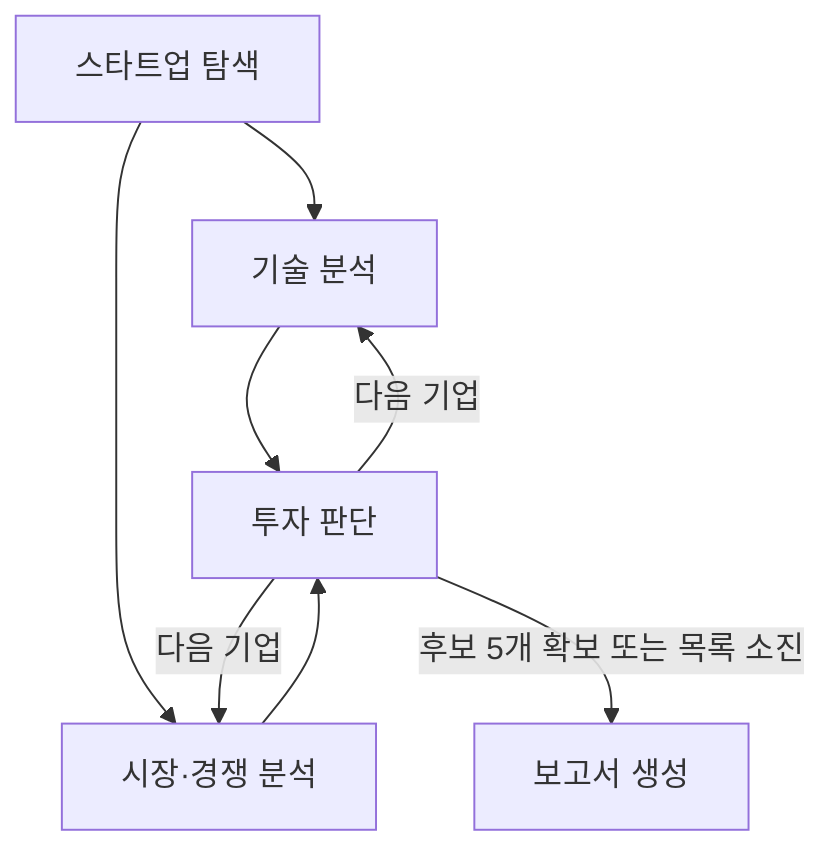

# 국내 Physical AI 스타트업 투자 분석

국내 비상장 Seed~Series C Physical AI 기업을 찾아 기술과 사업 근거를 비교합니다. 기술·시장 분석은 동시에 진행하고, 두 결과가 모두 도착하면 투자 판단을 수행합니다. 상장·Exit 완료 기업은 제외합니다.

[최종 투자 보고서](examples/final/investment-report.pdf) · [전체 분석 내용](examples/final/investment-report.md) · [과제 안내](https://actually-war-1ea.notion.site/AI-1cf7f4c86693800e9e11fa490ed1a2ff)

## 최종 결과

준비 후보 15개 중 9개를 평가했습니다. **확정 추천 0개·자격 확인 필요 조건부 후보 5개**입니다. 나머지 6개는 후보 5개 확보 후 종료되어 미평가입니다.

| 순위 | 기업 | 점수 | 구분 |
|---|---|---:|---|
| 1 | 로보아르테 | 16/18 | 자격 확인 필요 |
| 2 | 로보콘 | 15/18 | 자격 확인 필요 |
| 3 | 리옵스 | 15/18 | 자격 확인 필요 |
| 4 | 비욘드허니컴 | 14/18 | 자격 확인 필요 |
| 5 | 엔닷라이트 | 14/18 | 자격 확인 필요 |


이 제출본은 실제 자동 실행의 저장 자료를 Codex로 원문 대조·교정한 뒤 코드로 재채점하고 보고서를 다시 만든 결과입니다. 자동 실행 결과와 교정 결과를 구분하며, 팀 검토가 끝난 것으로 표시하지 않습니다. [변경 기록](examples/final/source_review.json)에 원본 실행·수정 전후·사유를 남겼습니다. 새 자동 실행에서도 동일한 기업과 점수가 나온다는 뜻은 아닙니다.

## 실행

Python 3.11을 사용합니다. macOS/Linux에서 프로젝트 폴더를 연 뒤 실행합니다.

```bash
python3.11 -m venv .venv
./.venv/bin/python -m pip install -r requirements.txt
./.venv/bin/python main.py demo
```

`demo`는 가상 기업으로 연결과 PDF 생성을 확인합니다. API 키나 임베딩 모델 다운로드가 필요하지 않습니다.

**실제 분석:** `.env.example`을 `.env`로 복사하고 본인의 `OPENAI_API_KEY`를 입력합니다. 팀에 공유한 준비 자료 ZIP을 프로젝트 폴더에 풀어 `data/prepared/manifest.json`이 보이게 둡니다.

```bash
./.venv/bin/python main.py live --max-candidates 20 --max-cost-usd 2
```

기존 문서·후보는 재사용하고 기술·시장 분석과 최종 검수는 다시 실행합니다. 최초 BGE-M3 다운로드와 로컬 임베딩에 시간이 걸릴 수 있습니다. 새 문서 수집은 준비 자료가 없거나 `--refresh-data`를 지정한 경우만 수행합니다. 웹 검색을 함께 사용하려면 `TAVILY_API_KEY`도 필요합니다. API 비용 한도는 기본 `live` 한 번의 추가 호출 기준이며 실제 청구액은 공급자 사용 내역에서 확인합니다.

**제출 보고서 재생성:** API 호출 없이 저장된 결과로 같은 내용의 PDF를 만듭니다.

```bash
./.venv/bin/python main.py report --records examples/final/records.json
```

출력 폴더는 `output/실행방식-날짜-시간/`으로 자동 생성됩니다. 결과는 `investment-report.pdf`와 `investment-report.md`입니다. Windows PowerShell에서는 `python3.11` 대신 `py -3.11`, `./.venv/bin/python` 대신 `.\.venv\Scripts\python.exe`를 사용합니다.

## 에이전트

| 담당 | 역할 | 입력 → 출력 | RAG |
|---|---|---|---|
| 박종찬 | ① 스타트업 탐색 | 도메인·조건 → 후보 목록·기업 자격·문서 | 적용 |
| 김민정 | ② 기술 분석 | 기업·기술 자료 → 기술·문제 해결·팀·위험 근거 | 적용 |
| 김희윤 | ③ 시장·경쟁 분석 | 기업·시장 자료 → 고객·수익모델·시장·경쟁 근거 | 적용 |
| 이현우 | ④ 투자 판단 | 분석·출처 → 점수·추천/조건부/보류·사유 | 미적용 |
| 박진원 | ⑤ 보고서 생성 | 평가 결과 → SUMMARY·본문·REFERENCE PDF | 미적용 |

## 실행 그래프



후보 목록은 탐색 단계에서 준비하고, 분석은 기업 하나씩 진행합니다. 기술·시장 분석은 서로의 결과를 기다리지 않지만 투자 판단은 **두 분석이 모두 완료된 뒤** 실행합니다. 다음 기업으로 갈 때 스타트업 탐색을 반복하지 않습니다.

`GraphState`는 현재 기업·순서·두 분석·누적 평가·후보 수·자료 쪽수·종료 사유를 공유합니다. 서로 다른 기업이나 회차의 결과를 합치지 않습니다. 코드의 `add_edge([기술, 시장], 판단)`가 합류를 처리합니다.

## 평가 기준

상·중·하를 3·2·1점으로 계산합니다. 여섯 항목을 모두 확인한 뒤 **12/18점 이상**이면 점수 기준을 통과합니다. 여섯 항목이 모두 중이면 12점이므로 초기 실증 기업도 검토 후보로 인정하는 기준입니다.

| 항목 | 상 | 중 | 하 |
|---|---|---|---|
| 문제 해결 효과 | 고객 환경 개선 효과 확인 | 고객 환경 PoC·실증 | 자체 실험·데모 확인 |
| 고객 구매 의사 | 유료 계약·판매·유료 PoC | 무료 PoC·MOU·LOI·도입 협의 | 고객 접점 부재 확인 |
| 외부 고객·현장 검증 | 실제 고객·현장 2개 이상 | 1개 | 0개 확인 |
| 수익모델 | 과금 구성 요소 4개 | 2~3개 | 0~1개 |
| 적용 분야 확장 | 실제 산업·사용 목적 2개 이상 | 1개 | 0개 확인 |
| 실행 지속성 | 현재 활동 + 날짜가 다른 완료 성과 2개 이상 | 최근 실제 사업 활동 | 사업 중단 확인 |

과금 요소는 지불 주체·판매 대상·과금 단위·가격 산정 방식입니다. 자료가 없으면 하 등급이나 0점 대신 **미확인**으로 남깁니다. 기업 자격까지 확인하면 추천, 자격 확인이 남으면 조건부 후보입니다. 점수 미달·근거 부족·확정 부적격은 보류합니다. 실행 실패는 근거 부족과 구분해 기록합니다.

추천·조건부 후보를 합쳐 처음 5개를 확보하면 종료하고 점수순으로 정리합니다. 전체 국내 기업 중 최상위 5개를 보장하지 않습니다. 목록을 소진하면 확보한 결과와 보류 사유로 보고서를 만듭니다. [상세 평가표](docs/평가기준.md)

## RAG와 기술

| 구분 | 사용 기술 |
|---|---|
| 흐름 제어 | LangGraph StateGraph·조건 분기·병렬 합류 |
| 생성 모델 | GPT-4.1-mini |
| 최종 근거 검수 | GPT-4.1·구조화된 사실·원문 검증 |
| 문서 분할 | RecursiveCharacterTextSplitter, 700자·겹침 100자 |
| 임베딩 | 로컬 BAAI/bge-m3 dense, 1024차원 |
| 검색 | FAISS·상위 4개 청크·회사별 검색 범위 |
| 재사용 | CacheBackedEmbeddings·LocalFileStore·준비 문서 보관 |
| PDF | ReportLab·pypdf·한글 글꼴 포함 |

문서 로딩 → 분할 → 임베딩 → 검색 → 출처와 질문을 모델에 전달하는 수업 흐름을 사용했습니다. 기술·시장 자료는 기업별로 검색하고 시장 규모·경쟁 대안에는 공통 산업 자료도 별도로 검색합니다. 산업 통계나 경쟁사 실적을 해당 기업의 점수로 사용하지 않습니다.

원문을 A4 PDF로 저장해 세 RAG 에이전트 전체의 실제 분량을 **200쪽 이하**로 관리합니다. 최초 149쪽에 시장·경쟁 공식 자료 15쪽을 보완한 최종 준비 자료는 **164쪽**입니다. 출처·수집일·페이지·파일 해시를 보관합니다. [자료 수집](docs/자료수집.md)

| 임베딩 후보 | 검토 이유 | 결과 |
|---|---|---|
| BAAI/bge-m3 | 한국어·영어 혼합 문서, 긴 입력, 로컬 재사용 | 선정 |
| nlpai-lab/KURE-v1 | 한국어 검색에 맞춘 후보 | 실제 비교 실험 전 |
| intfloat/multilingual-e5-large-instruct | 다국어 검색, 질의 지시문 활용 | 실제 비교 실험 전 |
| Qwen/Qwen3-Embedding-0.6B | 모델 크기를 고려한 다국어 후보 | 실제 비교 실험 전 |

사전 임베딩이 가능한 작은 자료 집합이므로 API 임베딩 비용보다 자료 적합성과 반복 실험을 우선했습니다. 후보 간 성능 우위를 실험으로 입증한 것은 아닙니다. OpenAI 임베딩은 과제의 오픈소스 조건 때문에 최종 후보에서 제외했습니다. [수업 예제와 연결](docs/수업코드검토.md)

## 코드 구조

```text
main.py                 전체 실행
workflow.py / models.py  그래프·공유 State
agents/                 다섯 에이전트
collection.py / rag.py   자료·RAG 공통 기능
grounding.py            주체·시제·고객 수·과금 요소 검증
common.py               모델 호출·비용·출처 검사
prepared_data.py        준비 자료 저장·재사용
config/                 평가표·자료 출처·실행 설정
data/prepared/          팀 공유 원문과 후보 목록 (별도 ZIP)
examples/final/         제출 보고서·재생성 입력·검토 기록
tests/                  자동 검사
team/                   역할별 코드와 수정 안내
```

## 검증

- 자동 검사: **278개 통과·선택 네트워크 검사 1개 생략·하위 검사 4개 통과**입니다.
- 전체 연결: 가상 기업 6개 평가 후 후보 5개 확보, 모두 보류일 때 7개 평가 후 종료를 확인했습니다.
- 제출 PDF: **5쪽**, 한글 본문 9.5pt입니다. 공개 저장 결과로 API 없이 재생성했습니다.
- 실제 BGE-M3 검색: 질문 15개, **Hit Rate@4 1.0 / MRR@4 0.956**입니다. Codex가 만든 원문 기반 회귀 질문이며 팀의 독립 평가나 답변 정확도 100%를 뜻하지 않습니다.
- 의존성 검사에 충돌이 없었습니다. 이번 원문 교정·재채점·보고서 검증의 추가 API 호출은 0회입니다.
- 새 구조화 검수 방식은 자동 검사로 확인했으며, 변경 후 유료 API 전체 실행은 다시 하지 않았습니다. 라이브 결과는 달라질 수 있습니다.

최종 검수는 원문 주체·완료/진행/계획·고객명·날짜·과금 요소를 분리해 확인합니다. 완료되지 않은 계획, 고객군을 고객 수로 센 결과, 다른 회사의 상장 사실은 제외합니다. 출력이 잘리면 예산 안에서 한 번만 재시도합니다. 이 장치가 모든 의미 오류를 자동으로 보증하지는 않습니다.

```bash
./.venv/bin/python -m pip install -r requirements-dev.txt
./.venv/bin/python -m pytest -q
./.venv/bin/python evaluate_retrieval.py --sources data/prepared/corpus/sources.json --questions data/evaluation.final.json --k 4
```

## Contributors

| 팀원 | 맡은 코드·확인 범위 |
|---|---|
| 박종찬 | 스타트업 탐색·기업 자격·자료 준비 |
| 김민정 | 기술 분석·기술 근거 |
| 김희윤 | 시장·경쟁 분석·고객과 사업 근거 |
| 이현우 | 투자 판단·평가표·점수 계산 |
| 박진원 | 보고서 생성·통합 실행·보고서 검토 |

위 표는 팀에서 정한 담당입니다. 박진원은 설계 결정 사항 전달, 로컬 실행 결과 확인, 평가표 변경 반영 요청과 보고서 수정을 진행했습니다. 사이트 조사와 시장 분석 코드 제안은 팀원들이 제공했으며, 개인별 실제 작업 내역은 팀 확인 후 추가합니다. Codex는 공통 코드·테스트 작성과 수정, 오류 점검, 저장 원문 교정, 제출 파일 정리를 보조했습니다.

공통 설계와 평가표 변경은 팀 논의 사항입니다. AI를 활용한 코드 초안·통합 수정·원문 교정은 개발 과정에 포함되며, 팀원이 직접 작성하거나 검토한 것으로 바꾸어 적지 않습니다.

## 설계 변경과 Lessons Learned

- 공개 자료로 확인하기 어려웠던 기존 시장 성장성·기술 차별성·팀 전문성·위험 관리 점수를 제외했습니다. 여섯 항목·12점 기준으로 바꾸되 관련 내용은 보고서에 계속 남겼습니다.
- 인용문이 원문에 있다는 사실만으로 판단이 맞지는 않았습니다. 주체·시제·실제 고객을 구분하는 검사를 추가했습니다.
- 상 등급 근거가 부족하더라도 중 등급 근거까지 버리면 안 됐습니다. 확인한 사실을 먼저 추출하고 점수는 코드로 계산합니다.
- 자동 생성 보고서에서 시장·경쟁 내용이 비어 있어 공통 자료 검색과 공식 제품 비교 자료를 보완했습니다.
- 같은 자료를 다시 수집하지 않고 재사용해 비용과 실행 시간을 줄였습니다. 자동 결과·원문 교정 결과·팀 검토 여부를 구분했습니다.

[개발 평가항목별 확인 위치](docs/제출기준.md) · [검증 기록](docs/검증기록.md)
