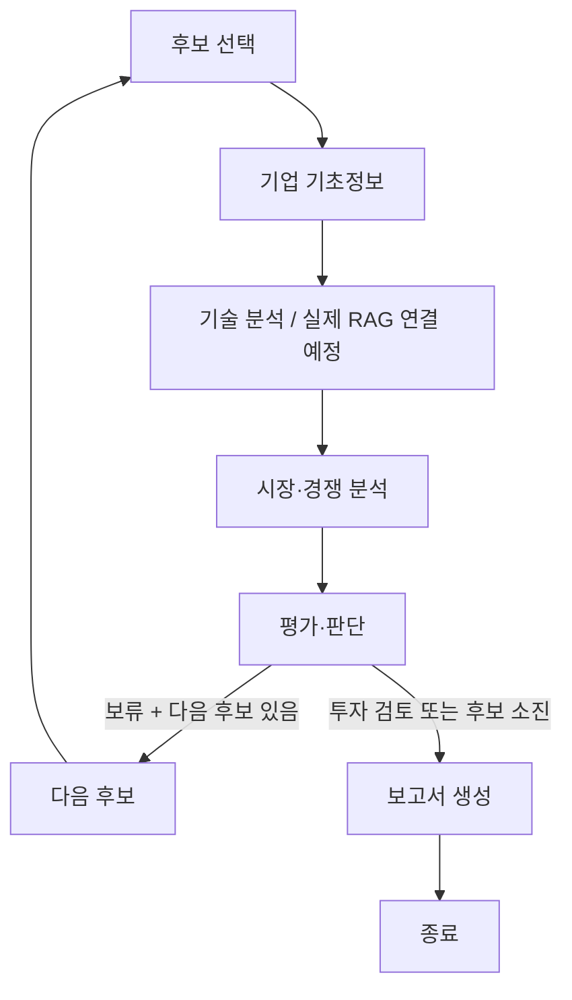

# AI Startup Investment Evaluation Agent

LangGraph 기반 AI 스타트업 투자 가능성 평가 프로젝트의 **5인 협업용 시작 저장소**입니다.
특정 회사에 종속되지 않습니다. 회사·도메인·분석 기준일은 팀이 선정합니다.

> 현재는 가상기업 fixture로 Graph·평가 계약·PDF 출력을 확인하는 데모입니다.
> 실제 기업 조사, 오픈소스 임베딩, VectorDB, RAG·LLM 분석은 구현 전입니다.
> 데모 통과나 CI 성공이 과제 완성을 뜻하지 않습니다.

## Overview

- Objective: 선정한 AI 스타트업의 팀·기술·시장·경쟁·실적·투자조건을 근거와 함께 평가합니다.
- Method: LangGraph Multi Agent + Agentic RAG (실제 에이전트/RAG 구현 예정).
- Domain: Agriculture (AgTech), Energy, Healthcare AI, Physical AI / Robotics, Semiconductor 중 선택.
- 기업 적격성: 비상장, Seed~Series C, 완료된 Exit가 없는지 공개 근거 확인.
- 기준 안내: [수업 과제 페이지](https://actually-war-1ea.notion.site/AI-1cf7f4c86693800e9e11fa490ed1a2ff).

## Features / 현재 상태

| 기능 | 상태 |
|---|---|
| 공통 Python/JSON 입력·출력 계약 | 준비됨 |
| 실제 기업과 무관한 합성 테스트 입력 | 준비됨 |
| 후보 평가 → 보류 시 다음 후보 → 후보 소진 시 보고서 | 데모 구현 |
| 근거 없는 점수 거절, 미확인 값 보존 | 데모 구현 |
| JSON·Markdown·PDF 자동 출력 | 데모 구현, 실제 제출 보고서 미완료 |
| 실제 자료 수집·전처리·200쪽 확인 | 담당 A 구현 필요 |
| 오픈소스 임베딩·검색·기술 분석 | 담당 B 구현 필요 |
| 시장·경쟁 분석 도구와 에이전트 | 담당 C 구현 필요 |
| 실제 평가척도·판단 검증 | 담당 D 구현 필요 |
| 실제 Agentic RAG의 재검색·도구선택·근거검증 | B/E 연결·검증 필요 |

## Tech Stack

- Framework: LangGraph (Python 3.11에서 확인)
- LLM/Generator, LLM/Judge: 미선정 / 현재 호출하지 않음
- Retrieval / VectorDB: 미구현
- Hit Rate@K, MRR: 미측정 (실제 문서와 정답셋으로 측정할 것)
- Embedding: 오픈소스 모델 후보 비교 후 선택 예정
- Reporting: ReportLab, pypdf
- 기본 실행의 정확한 의존성: `requirements.txt`

## Agents / 담당 경계

| 역할 | 책임 | 개발 담당 |
|---|---|---|
| 기업 탐색·기초정보 | 후보 자격, 팀, 제품, 실적, 투자 관련 자료 | A |
| 기술 분석 | 실제 문서 검색과 근거 기반 기술 요약·평가 | B |
| 시장·경쟁 분석 | 수요, 시장 범위, 대안, 비교 근거 | C |
| 투자 판단 | 항목별 점수·근거 검사, 가중합, 투자/보류 이유 | D |
| 보고서 생성·흐름 제어 | State, 분기·종료, 분석 통합, PDF 출력 | E |

현재 `agents/analysis.py`는 fixture를 읽는 대체 구현입니다. 실제 LLM 에이전트가 아닙니다.
각 담당자는 같은 `contracts/schema.py` 형식으로 결과를 반환하는 실제 구현으로 교체합니다.
E의 부담을 나누기 위해 D는 보고서의 판단·근거·리스크 본문을, 전원은 README 자기 파트를 작성합니다.

## Architecture



위 그래프는 **현재 데모 흐름**입니다. 실제 검색 필요성 판단·제한된 재검색은 [설계 초안](docs/design.md)의 추가 구현 대상입니다.
개발은 fixture를 사용해 동시에 진행합니다. 실행 순서가 개발 순서를 뜻하지 않습니다.

## Directory Structure

```text
config/       # 회사·도메인·기준일, 평가 정책
contracts/    # 먼저 합의할 공통 결과 형식
fixtures/     # 실제 기업과 무관한 합성 입력
data/         # 출처 목록·원문·전처리·검색 평가셋
rag/          # 담당 B의 검색 구현 영역
agents/       # 역할별 분석·평가 코드
workflow/     # StateGraph 연결과 조건 분기
reporting/    # 파일 출력
prompts/      # 실제 에이전트 프롬프트 작성 영역
outputs/      # 로컬 생성 결과 (기본 Git 제외)
tests/        # 계약·분기·출력 확인
docs/         # 과제 체크리스트·분담·설계 초안
app.py        # 실행 진입점
```

## Usage

Python 3.11 사용을 권장합니다. macOS/Linux 예시:

```bash
git clone https://github.com/nowjinpark/ai-startup-investment-agent.git
cd ai-startup-investment-agent
python3.11 -m venv .venv
source .venv/bin/activate
python -m pip install -r requirements.txt
python app.py --mode demo
python -m unittest discover -s tests -v
```

Windows는 `py -3.11 -m venv .venv`, `.venv\Scripts\Activate.ps1`로 환경을 활성화합니다.

- 데모는 API 키·유료 호출·임베딩 모델 다운로드 없이 실행됩니다.
- `outputs/demo/DEMO-report.{json,md,pdf}`가 생성됩니다. 데모 파일은 제출용이 아닙니다.
- `--mode live`는 아직 구현되지 않았으므로 명확한 오류로 종료됩니다.
- Linux 등에서 PDF 한글 글꼴 표시를 검증하세요. 필요하면 로컬 TTF 경로를 `REPORT_FONT_PATH` 환경변수에 지정합니다.
- 현재 코드는 `.env`를 자동으로 읽지 않습니다. 실제 API 연동 시 로더를 추가하고 키를 출력하지 마세요.

## 회사 변경

1. [config/project.json](config/project.json)에 선정 도메인·기준일·후보 목록을 작성합니다.
2. [data/sources.json](data/sources.json)에 후보별 출처와 페이지 수를 기록합니다.
3. 회사별 자료를 candidate_id로 연결하고 검색에 같은 ID 필터를 적용합니다.
4. [config/evaluation.json](config/evaluation.json)의 평가 정책과 도메인별 점수 정의를 합의합니다.

현재 프로젝트 설정은 실제 구현을 위한 계약이며 데모 입력은 별도입니다. 실제 분석 연결은 담당자가 구현합니다.

## 병렬 개발 시작

먼저 전원이 공통 계약·평가 기준·문서 공개 범위를 합의한 뒤 A~E 기능을 독립 구현합니다.
다른 담당자의 결과가 준비되기 전에는 같은 형식의 fixture를 사용합니다.

- [공통 작업 / 5인 분담 / 발표 계획](docs/team-plan.md)
- [State와 Graph 설계 초안](docs/design.md)
- [전체 요구사항과 배점·제출 체크리스트](docs/assignment-checklist.md)

각자 기능 브랜치에서 작업하고 PR로 합칩니다. 다른 담당자 한 명이 공통 계약과 실행 결과를 확인합니다.
계약 변경은 전원 공유 후 반영합니다. `.env`, 강의 PDF, 녹음본, 공유 권한 없는 원문은 올리지 않습니다.

## Deliverables / 제출 전 완료할 항목

- DAY 3 10:00: 설계 PDF. 도메인, Agent/RAG/임베딩, 평가표, State 표, Mermaid, 보고서 목차.
- DAY 3 15:00: GitHub 링크, README, 실제 자동 생성 투자 보고서 PDF.
- 전체 입력 문서는 200쪽 이하. 최소 지정 역할 하나에 실제 RAG. 오픈소스 임베딩 필수.
- 최종 보고서는 5쪽 이하, 첫 SUMMARY 반 쪽 이하, 끝 REFERENCE는 실제 사용 자료만.
- 발표는 README로 10분. 핵심 결과와 Lessons Learned 포함.
- 전체 배점은 [체크리스트](docs/assignment-checklist.md) 참고. 제출 파일명은 수업 안내에 따라 캠퍼스·반·팀원 이름을 넣어 확정합니다.

## Contributors

역할은 아직 미정입니다. 아래 이름 순서는 역할 배정이나 기여 순위를 의미하지 않습니다.
개발 후 실제 수행한 기술 역할을 기록합니다. PM/PL 역할로 대체하지 않습니다.

| 이름 | GitHub | 실제 수행 역할 |
|---|---|---|
| 김민정 | 미정 | 미정 |
| 김희윤 | 미정 | 미정 |
| 박종찬 | 미정 | 미정 |
| 박진원 | [nowjinpark](https://github.com/nowjinpark) | 미정 |
| 이현우 | 미정 | 미정 |

## Lessons Learned

구현·평가 후 각자 한 가지씩 추가합니다. 현재는 아직 작성 전입니다.
