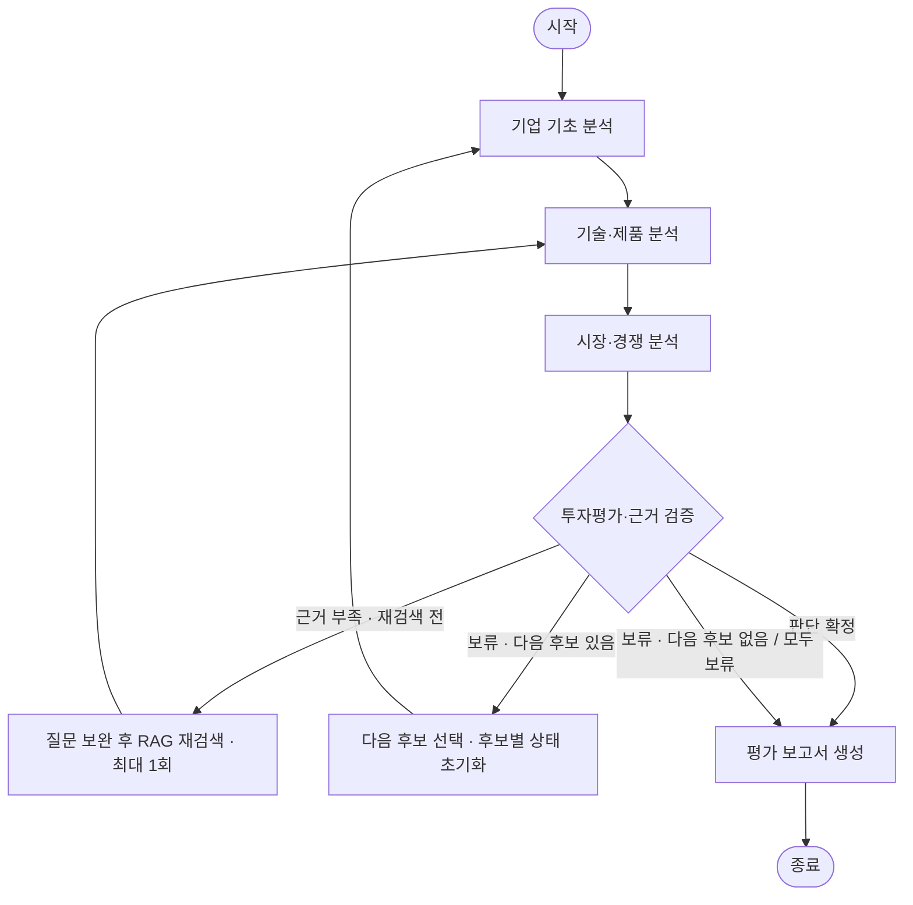

# AI 스타트업 투자평가 에이전트 설계 초안

이 문서는 1.5일 과제를 함께 시작하기 위한 **설계 초안**이다. 아래 흐름과 검증 항목은 구현 목표이며, 시작 코드가 실제 RAG·모델 호출·재검색·PDF 생성을 모두 완료했다는 뜻이 아니다. 실제 기능을 구현한 뒤 코드와 일치하도록 수정하고 **DAY3 10:00 설계 PDF**를 준비한다. 개발 산출물은 **DAY3 15:00** 제출을 목표로 한다.

## 1. 문제와 범위

공개자료를 바탕으로 팀이 선택한 AI 스타트업의 사업·기술·시장·투자 관련 근거를 모아 평가 보고서를 생성한다. 과제가 허용한 5개 도메인 중 하나를 선택하며, 도메인·기업·분석 기준일·후보 목록은 `config/project.json`에서 교체한다. 시스템은 출처가 연결된 평가표, 판단 근거, 리스크, 미확인 정보와 추가 실사 질문을 반환하는 것을 목표로 한다.

회사별 고객 문제·제품과 평가 범위를 팀이 합의한다. 투자 유치, 고객 도입, 제품 성능 주장의 시점과 적용 범위를 분리하고, 공개되지 않은 매출·투자조건을 추정해 채우지 않는다. 현재 데모의 두 가상 후보는 회사에 종속되지 않는 연결 흐름을 확인하기 위한 예제이며, 실제 기업 분석은 미구현 상태다. 최종 결과도 수업용 공개자료 분석으로서 실제 투자심사의 모든 정보를 확보한 결과는 아니다.

## 2. 역할별 에이전트와 도구

| 논리 역할 | 책임 | 사용하는 근거·도구 | 다음 단계에 넘길 내용 |
| --- | --- | --- | --- |
| 기업 기초 분석 | 사업 아이디어, 고객 문제, 창업팀과 기업 적격성 확인 | 정제 문서와 출처 목록, 공통 검색 도구 | 회사 기초 분석과 확인·미확인 사항 |
| 기술·제품 분석 | AI 역할, 제품 구조, 기술 근거·한계 분석 | 오픈 임베딩 기반 RAG | 기술 분석과 검색 근거 |
| 시장·경쟁 분석 | 시장 범위·규모, 경쟁 대안, 시장·경쟁·규제 리스크 분석 | RAG와 기준일이 있는 공개 시장 자료 | 시장·경쟁 분석과 인용 근거 |
| 투자평가·판단 | Traction·Deal, 점수 집계, 근거 검증, 판단 또는 보류 | 앞 단계 결과와 필요한 추가 검색 | 평가표, 판단 근거, 재검색 필요성, 보고서 본문 |
| 보고서 생성 | 확정된 분석과 미확인을 문서에 표현 | 내용 템플릿과 PDF 출력 도구 | SUMMARY와 REFERENCE를 포함한 5쪽 이하 보고서 |

멀티에이전트 역할은 책임 분리를 뜻한다. 각 역할은 공통 검색 도구와 계약을 재사용하며, 서로 다른 이름으로 같은 답변을 반복 생성하는 데 그치지 않는다. 팀원별 구현 책임은 [팀 계획](team-plan.md)에 정리한다.

## 3. RAG와 오픈 임베딩

RAG에 들어가는 공개자료는 총 **200쪽 이하**로 관리한다. 모든 후보와 재실행·재검색으로 추가된 자료를 전체 목록에서 누적 집계한다. 후보나 실행 횟수가 달라졌다고 각각 200쪽을 새로 허용하지 않는다. 회사·파트너 공식 자료, 기관 자료, 기술 자료와 필요한 보도를 선별한다. 중복 기사로 근거가 여러 번 검증된 것처럼 보이지 않게 한다. 원문을 공개 저장소에 재배포할 권한은 별도로 확인한다.

처리 순서는 문서 수집·출처 등록 → 정제·분할 → 오픈 임베딩 → 검색 저장소 → 질문별 검색 → 출처가 포함된 문맥 전달이다. 최소 1개 RAG를 실제 평가 흐름에 연결한다. 문서 제목·원문 링크·기준일·페이지 등 출처 정보가 최종 보고서까지 추적되도록 계약과 저장 형식을 맞춘다.

임베딩 모델은 팀이 실제로 사용할 오픈 모델로 확정한다. 한국어 자료의 검색 성능, 문서·질문의 언어, 메모리와 실행 시간, 재현 가능한 버전, 이용 조건을 비교해 선정 이유를 기록한다. 특정 모델을 설치하거나 실행해 보지 않은 상태에서 성능 우위를 단정하지 않는다.

- [ ] 모델명·버전·차원과 선정 이유를 실제 설정에 맞게 채운다.
- [ ] 문서 분할 크기·중첩·검색 개수와 저장소를 실험 후 기록한다.
- [ ] 문서별 페이지 수와 전체 200쪽 제한을 확인한다.
- [ ] 고정 질문에서 관련 자료가 검색되는지와 출처 연결이 정확한지 확인한다.

## 4. State와 입출력 계약

**정확한 필드·형식·함수 계약의 기준은 `contracts/schema.py`다.** 이 문서는 개발 중인 계약과 충돌하지 않도록 별도의 상세 필드를 정의하지 않는다. 팀은 착수 단계에서 계약을 고정하고, 변경이 필요하면 예제 입력·관련 모듈·검증을 함께 수정한다.

상태에는 기업 분석의 진행과 근거, 각 역할의 결과, 판단, 재검색 횟수, 후보 전환과 종료에 필요한 정보가 전달되어야 한다. 노드는 자신이 책임지는 결과만 갱신한다. 다른 노드의 근거를 덮어쓰거나, 이전 후보의 분석 결과를 새 후보의 결과처럼 재사용하지 않도록 한다.

모든 담당자는 계약에 맞는 같은 버전의 예제 입력으로 독립 개발한다. 실제 외부 모델을 호출하지 않은 모의 출력은 연결 검증에만 사용하며, 투자평가 결과나 RAG 성능으로 제시하지 않는다.

## 5. Graph와 Agentic RAG 계획

개발은 5명이 병렬로 진행한다. 실제 분석 실행은 앞 단계의 결과를 이어받는 다음 순차 흐름을 기본으로 한다.

재검색은 단순히 매번 자동 실행하는 단계가 아니다. 판단에 필요한 근거가 누락되면 해당 질문을 보완해 **후보당 최대 1회** 추가 검색하고 기술·시장 분석과 판단을 다시 수행하는 계획이다. 재검색 뒤에도 근거가 부족하면 임의 점수를 확정하지 않고 보류한다. 재검색 횟수와 부족한 근거를 실행 기록에서 확인할 수 있어야 한다.

과제의 후보 전환 요구를 확인할 수 있도록 `config/project.json`에 비교 가능한 다른 후보를 함께 준비하고, 첫 후보가 보류되면 다음 후보를 평가하는 분기를 검증한다. 단일 후보에서 보고서로 종료하는 동작만으로 후보 전환 요건을 충족했다고 단정하지 않는다. 현재 두 가상 후보 데모는 연결 예제이며, 실제 자료를 사용한 분기 검증을 대신하지 않는다. 후보가 모두 보류되거나 목록이 소진되면 근거 부족과 한계를 보고하고 종료하며, 마지막 기업을 억지로 선정하지 않는다. 이 분기와 재검색 루프의 **실제 분석 구현·검증은 완료 전까지 미완료로 표시**한다.

## 6. 평가 기준과 근거 검증

참고 가중치는 창업자·팀 30, 시장 25, 기술·제품 15, 경쟁우위 10, Traction 10, Deal 10으로 합계 100이다. 팀은 변경할 수 있지만 개발 전에 이유와 최종 기준을 합의하고 `config/evaluation.json`에 반영한다. 도메인·기업을 변경할 때 기준의 적합성을 재검토한다. 항목별 점수 척도, 판단 기준, 보류 조건은 해당 설정과 실제 평가 함수에서 일치시킨다.

평가표의 각 판단은 검색 근거와 연결한다. 자료에 없다는 이유만으로 매출이나 고객 수를 0으로 취급하지 않는다. 회사의 주장과 파트너·기관의 확인, 실증 계획과 유료 도입, 투자 유치 규모와 기업가치, 과거 자료와 현재 상태를 구분한다. 불일치가 있으면 출처와 시점을 함께 설명한다.

시스템의 검증은 투자 점수와 구분한다. 다음 사례의 실제 결과를 남긴다.

| 검증 사례 | 확인할 동작 |
| --- | --- |
| 정상 근거가 있는 질문 | 관련 문서를 검색하고 인용이 연결된 분석·보고서 생성 |
| 문서에 없는 질문 | 모른다고 표시하거나 근거 부족으로 보류 |
| 1차 검색 근거 부족 | 최대 1회 재검색 후 재판단, 반복 상한 준수 |
| 충돌하거나 오래된 자료 | 시점·출처의 차이 표시, 임의 병합 방지 |
| 첫 후보 보류, 다른 후보 있음 | 다음 후보를 선택하고 후보별 분석 상태를 초기화해 평가 수행 |
| 후보 없음 또는 모두 보류 | 설명과 한계가 포함된 보고서로 종료 |
| 새 환경 재현 | README와 허용된 입력 준비 절차만으로 실행 |

## 7. 보고서와 재현 산출물

보고서 내용 템플릿과 점수·근거의 일관성은 D가, 실제 PDF 파일 출력과 페이지 검증은 E가 책임진다. **시스템이 생성한 보고서는 5쪽 이하**이며, 첫 SUMMARY는 **0.5쪽 이하**, 마지막은 실제 인용 자료만 정리한 **REFERENCE**로 구성한다.

권장 배분은 SUMMARY 0.5쪽, 사업 아이디어·팀 1쪽, 기술·시장·경쟁 1.5쪽, 투자평가·시장/기술/규제/경쟁 리스크·한계 1.5쪽, REFERENCE 0.5쪽이다. 이는 팀의 편집 계획이며, 필수 내용과 전체 제한을 지키는 범위에서 조정한다. 시장 규모의 단위와 범위, 검증되지 않은 주장과 정보 공백을 분명하게 쓴다.

GitHub에는 실행 가능한 코드, 의존성·환경 예시, 자료 준비 방법, 공통 계약과 필요한 예제 입력을 둔다. README는 문제·설계·실행·검증·실제 결과·한계·기여를 포함하고 10분 발표의 화면으로 사용한다. 각자 자기 부분을 작성하며, contributor에는 PM/PL이 아닌 직접 수행한 코드·분석·검증 업무를 적는다.

## 8. 제출 전 설계 확정

- [ ] 계획과 실제 코드의 차이를 수정했다.
- [ ] 설계 총 100점·개발 총 100점의 모든 항목을 [과제 점검표](assignment-checklist.md)와 대조했다.
- [ ] 실제 RAG·모델 실행과 근거 부족 분기의 결과를 확인했다.
- [ ] 설계 PDF와 생성 보고서 PDF를 구분해 준비했다.
- [ ] 5쪽 제한과 SUMMARY·REFERENCE를 확인하고 인용을 원문과 대조했다.
- [ ] README만으로 다른 팀원이 재현하고 10분 발표를 연습했다.
